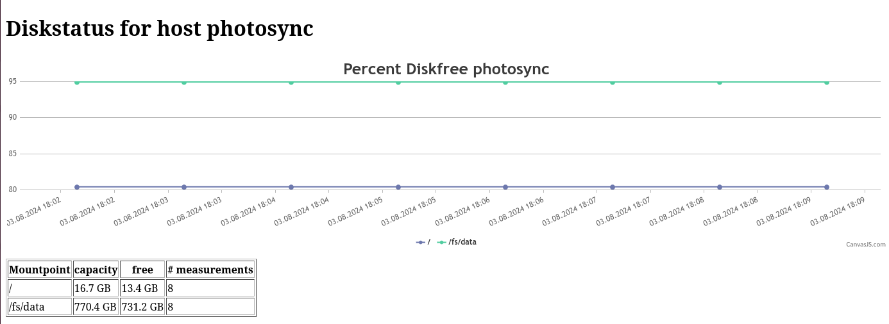

# minimon
minimon is a minimal monitoring package, focusing on disk stats.

## building

```
$ cargo build
```

build the debian / ubuntu package
```
./build_deb.sh
```

## running

```
cargo run --release
```

the agent will listen on port `9988` and show simple stats like this:


You can grab the data as json:
```
$ curl -H "Accept: application/json" http://solar:9988/ | python -m json.tool - 
  % Total    % Received % Xferd  Average Speed   Time    Time     Time  Current
                                 Dload  Upload   Total   Spent    Left  Speed
100   208  100   208    0     0   9398      0 --:--:-- --:--:-- --:--:--  9454
{
    "/": [
        {
            "bytes_free": 3323228160,
            "bytes_total": 8350298112,
            "ts": 1722697823
        },
        {
            "bytes_free": 3323252736,
            "bytes_total": 8350298112,
            "ts": 1722698963
        },
        {
            "bytes_free": 3323248640,
            "bytes_total": 8350298112,
            "ts": 1722699023
        }
    ]
}
```

